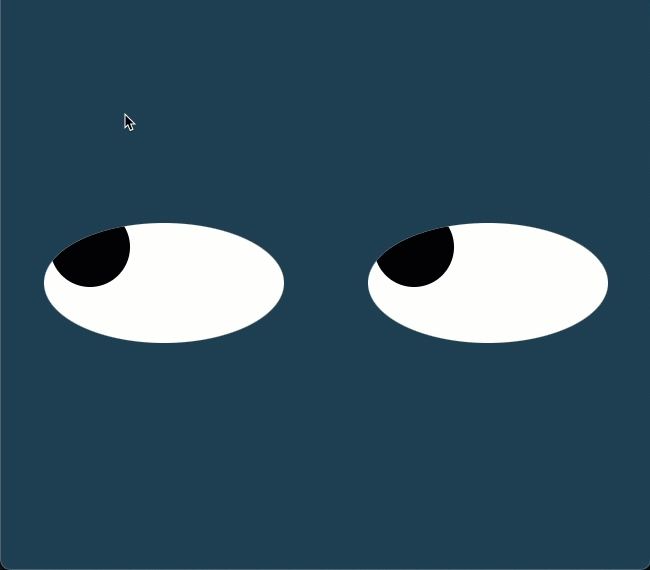

# eye-movement

## Descripción

En este ejercicio de la semana 8 se puso en práctica el uso de estilos y de los eventos del mouse click, mousemove 
y mouseleave para simular el movimiento de un par de ojos siguiendo la dirección del cursor del mouse sobre la pantalla. 

## Ejecución

<ol>
<li>Descargar los archivos:
    <ol>
    <li>Entrar a la pestaña Code</li>
    <li>Dar clic en el botón <>Code</li>
    <li>Esto abrirá una pequeña ventana donde se debe seleccionar la opción Download ZIP</li>
    </ol>
</li>
<li>Descomprimir el directorio descargado</li>
<li>ingresar a la carepta principal</li>
<li>Abrir el archivo index.html en el navegador web de su preferencia</li>
<li>Mover el mouse sobre la pantalla para ver el efecto de movimiento de ojos</li>
</ol>

## Roadmap

<ol>
<li>Redimensionar el tamaño de los ojos conforme la pantalla se reduce</li>
<li>Tener la opción de controlar los ojos por separado</li>
</ol>

## Licencia

MIT Licence